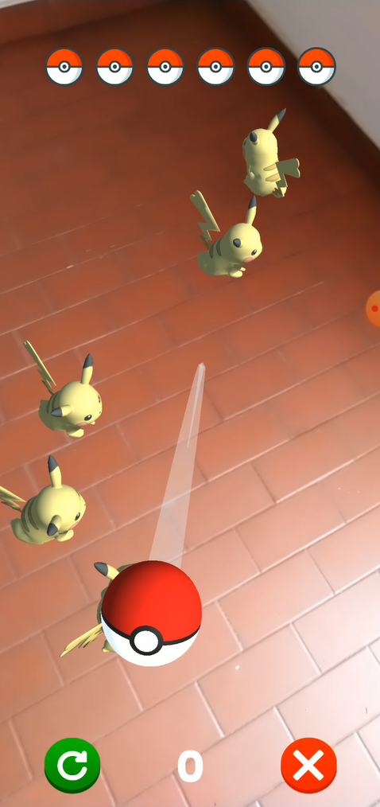

# AR Slingshot Game
## Description
This is a slingshot-type video game in Augmented Reality, which simulates some mechanics of the popular Pokemon GO video game, created in Unity using the AR Foundation.  

## Installation
* If you want to edit the game:  
  * Download untity from its official site https://unity3d.com/es/get-unity/download
  * Clone this repository `git clone https://github.com/santiagopemo/AR_slingshot_game/`
  * When you have opened the project in Unity go to file -> Build Settings -> Build

* If you only want to play, download any of the following versions for mobile platforms and install it in your device 
  * **[Android](https://drive.google.com/file/d/1nL1ZDRkA8SLhnMmuci_aPvNRqYNUEYMB/view?usp=sharing)**
  * **[iOS](https://drive.google.com/file/d/18toqTNN7b-BRhVTeDf0MiIbQaIjObjCs/view?usp=sharing)** 

## Usage
Watch the following video: **[AR Slingshot Game in Unity with AR Foundation](AR Slingshot Game in Unity with AR Foundation)**  

Once the application starts, the first thing you should do is look for a plane, just point the camera of your device towards a horizontal surface  

Once you have found one or more plans, select the one you want, the Pikachu and the **Start** Button will appear, press the button when you feel ready to start playing  

Grab and drop the pokeballs towards the Pikachus to catch them. At the top of the screen you will see the number of remaining pokeballs and at the top your current score and two buttons, one to **Exit** the application and another to **Restart** it.

Finally when you find all the pikachus trapped or you run out of pokeballs you can access the **Leader Board** or **Play Again**  

## Author :pencil:
### Santiago Peña Mosquera  
Mechatronic engineer and student of software development in holberton school, lover of building new things from scratch, that's why my passion for programming, starting from an empty sheet and turning it into a solution for real problems.  
<a href="https://www.linkedin.com/in/santiago-pe%C3%B1a-mosquera-abaa20196/" target="_blank">LinkedIn</a>&nbsp;&nbsp;&nbsp;&nbsp;
<a href="https://twitter.com/santiagopemo" target="_blank">Twitter</a>
